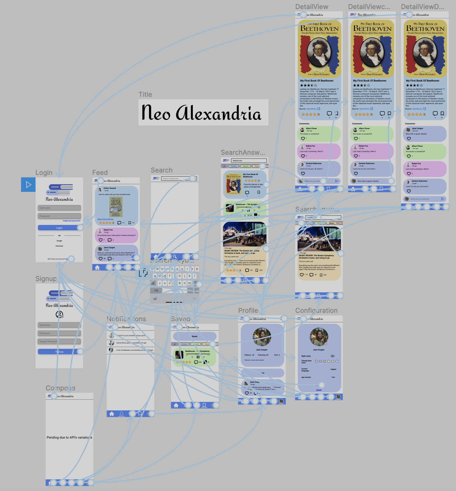

App Design Project
===

# Neo Alexandria

## Table of Contents
1. [Overview](#Overview)
1. [Product Spec](#Product-Spec)
1. [Wireframes](#Wireframes)
2. [Schema](#Schema)

## Overview
### Description
A free and open virtual library, where you will be able to find news, music and of course books, for free. Users can share their opinion of the content with commentaries and give them punctuation that will help the community to find better content. You can also build your personal library, saving all those resources in your account.

### App Evaluation

- **Category:** Educational / Social networking
- **Story:** Create a platform that offers you the resources that you need and show what people think of those resources (rating resource quality and commenting if there was another resource better for them), this can save people a lot of time. As well as saving these resources in the app. And know new resources for different topics.
- **Market:** All people on the internet are looking for free music, books and news as well as opinions of these resources.
- **Habit:** People are using this constantly throughout their life searching topics of interest for them. Especially if they are students.
- **Mobile:** Mobile version is better because it would let users easily access to resources that they saved even without internet connection, as well as be capable of uploading photos for your profile or posts.
- **Scope:** V1 would let people search and view by title the resources they want and this will be built over the core of the app (require planning and future goals for next versions). V2 would incorporate the save resource feature.  V3 would add comment and rating for every resource as well as a details view. V4 would let users add posts talking about some resources or adding their own ones, as well as asking the community for resources, as well as all the required stories. V5 will implement all the bonus stories.

## Product Spec

### 1. User Stories (Required and Optional)

**Required Must-have Stories**

---
* [ ] User can login to his or her account
* [ ] The current signed in user is persisted across app restarts
* [ ] Successful login animation <span style="color:red">*</span>
* [ ] User can sign up to create a new account using Parse authentication
---
* [ ] User can compose posts
* [ ] User can compose resources
* [ ] User can see other users posts
* [ ] User can see other users resources
---
* [ ] Every image uploaded pass through a secure content filter to avoid NSFW content using the machine learning power (from an API) <span style="color:red">*</span>
---
* [ ] Everything posted includes: photo and name of the user who posted it, timestamp and content (it can include pictures).
* [ ] Every post has a like icon(actionable) and the count.
* [ ] Every post has a comment icon(actionable) and comment count.
* [ ] Every post has a save icon(actionable) and saved count.
* [ ] Posts have the same 3 past user stories in details view.
---
* [ ] Every resource has a rating(actionable)
* [ ] Every resource has a comment icon(actionable) and comment count.
* [ ] Every resource has a save icon(actionable) and saved count.
* [ ] Resources have the same 3 past user stories in details view.
---
* [ ] User can see the last 20 items (posts, resources, commentaries) where needed.
* [ ] User can pull down to refresh the last 20 items.
---
* [ ] Every resource or post is clickable, and when it is clicked, you go to the detail view of that item.
* [ ] In detail view you can see the commentaries of the resource
* [ ] Commentaries can only be liked
---
* [ ] User will be able to search the resources they want by title and will see them displayed.
* [ ] In Search view you can filter the results by category (All (default), books, music, news and posts by other users). <span style="color:red">*</span>
---
* [ ] The layout of every item as well as the detail view depends on the type of item (music, news, books, etc). <span style="color:red">*</span>
* [ ] Music Item is playable in the style is like a media player in both item and details view. <span style="color:red">*</span>
* [ ] Music is running even with the app running in the background or/and the smartphone on standby status. <span style="color:red">*</span>
* [ ] User can open a pdf reader view in the book details view in the same app. <span style="color:red">*</span>
---
* [ ] User can see the resources he or she saved with the same layout and details view used in search activity in saved activity.
* [ ] Saved resources can be view without internet connection if the user want to save them (download button) <span style="color:red">*</span>
---
* [ ] User can log out to his or her account
* [ ] User can change the profile image
---
* [ ] Bottom navigation bar
* [ ] Custom Toolbar
* [ ] Use a gesture
* [ ] The app incorporates at least one external library to add visual polish
* [ ] Spanish and English available for the app depending of the smartphone configuration language <span style="color:red">*</span>

**Optional Nice-to-have Stories**
* [ ] Users can login with at least one third party service. (like google, facebook, github, etc)<span style="color:red">*</span>
* [ ] User can see other users' profile
* [ ] User can see the description of the user, number of posts and user's posts.
* [ ] User can follow other users
* [ ] User can see the number of followers and followers, as well as have a follow button in every profile.
---
* [ ] User can see notifications about commentaries in his or her posts.
* [ ] Infinite pagination everywhere it can be used.
* [ ] Follow de UI used in wireframes.
* [ ] Use fragments instead of activities in sections.
* [ ] Easter egg EUREKA
* [ ] Custom app icon
* [ ] Blur video as background in login and signup
* [ ] While sign up assigned predefined random names and profile images
* [ ] Sort and filter resources by rating
* [ ] User can filter resources just like in the search view in saved items.
* [ ] User can update the app or search for new updates <span style="color:red">*</span>
* [ ] User can set night/dark mode <span style="color:red">*</span>
* [ ] User can choose their main color (color used in their posts and profile). <span style="color:red">*</span>
* [ ] User receive a notification every time a user's follow account post something <span style="color:red">*</span>
* [ ] Progress bars where needed

### 2. Screen Archetypes

* No specific screen
  * [ ] Every image uploaded pass through a secure content filter to avoid NSFW content using the machine learning power (from an API) <span style="color:red">*</span>
  * [ ] Bottom navigation bar
  * [ ] Custom Toolbar
  * [ ] Use a gesture
  * [ ] The app incorporates at least one external library to add visual polish
  * [ ] Spanish and English available for the app depending of the smartphone configuration language <span style="color:red">*</span>

* Login
  * [ ] User can login to his or her account
  * [ ] The current signed in user is persisted across app restarts
  * [ ] Successful login animation <span style="color:red">*</span>


* Signup
  * [ ] User can sign up to create a new account using Parse authentication

* Feed
  * [ ] User can see other users posts
  * [ ] User can see other users resources
  * [ ] Everything posted includes: photo and name of the user who posted it, timestamp and content (it can include pictures). **FEED SAVED**
  * [ ] Every post has a like icon(actionable) and like count. **FEED SAVED**
  * [ ] Every post has a comment icon(actionable) and comment count. **FEED SAVED**
  * [ ] Every post has a save icon(actionable) and saved count. **FEED SAVED**
  * [ ] Posts have the same 3 past user stories in details view. **FEED SAVED**
  * [ ] Every resource has a rating(actionable) **FEED SEARCH SAVED**
  * [ ] Every resource has a comment icon(actionable) and comment count. **FEED SEARCH SAVED**
  * [ ] Every resource has a save icon(actionable) and saved count. **FEED SEARCH SAVED**
  * [ ] Resources have the same 3 past user stories in details view. **FEED SEARCH SAVED**
  * [ ] Every resource or post is clickable, and when it is clicked, you go to the detail view of that item.**FEED SEARCH SAVED**
  * [ ] In detail view you can see the commentaries of the resource**FEED SEARCH SAVED**
  * [ ] Commentaries can only be liked**FEED SEARCH SAVED**
  * [ ] User can see the last 20 items (posts, resources, commentaries) where needed. **FEED SEARCH SAVED**
  * [ ] User can pull down to refresh the last 20 items. **FEED SEARCH SAVED**
  * [ ] The layout of every item as well as the detail view depends on the type of item (music, news, books, etc). <span style="color:red">*</span> **FEED SEARCH SAVED**
  * [ ] Music Item is playable in the style is like a media player in both item and details view. <span style="color:red">*</span> **FEED SEARCH SAVED**
  * [ ] Music is running even with the app running in the background or/and the smartphone on standby status. <span style="color:red">*</span>**FEED SEARCH SAVED**
  * [ ] User can open a pdf reader view in book details in the same app. <span style="color:red">*</span>**FEED SEARCH SAVED**

* Compose Activity
  * [ ] User can compose posts
  * [ ] User can compose resources

* Search
  * [ ] Users will be able to search the resources they want by title and will see them displayed.
  * [ ] In Search view you can filter the results by category (All (default), books, music, news and posts by other users). <span style="color:red">*</span>
  * [ ] Every resource has a rating(actionable) **FEED SEARCH SAVED**
  * [ ] Every resource has a comment icon(actionable) and comment count. **FEED SEARCH SAVED**
  * [ ] Every resource has a save icon(actionable) and saved count. **FEED SEARCH SAVED**
  * [ ] Every resource or post is clickable, and when it is clicked, you go to the detail view of that item. **FEED SEARCH SAVED**
  * [ ] In detail view you can see the commentaries of the resource**FEED SEARCH SAVED**
  * [ ] Commentaries can only be liked**FEED SEARCH SAVED**
  * [ ] User can see the last 20 items (posts, resources, commentaries) where needed. **FEED SEARCH SAVED**
  * [ ] User can pull down to refresh the last 20 items.**FEED SEARCH SAVED**
  * [ ] The layout of every item as well as the detail view depends on the type of item (music, news, books, etc). <span style="color:red">*</span> **FEED SEARCH SAVED**
  * [ ] Music Item is playable in the style is like a media player in both item and details view. <span style="color:red">*</span> **FEED SEARCH SAVED**
  * [ ] Music is running even with the app running in the background or/and the smartphone on standby status. <span style="color:red">*</span>**FEED SEARCH SAVED**
  * [ ] User can open a pdf reader view in the book details view in the same app. <span style="color:red">*</span>**FEED SEARCH SAVED**

* Saved
  * [ ] Saved resources can be view without internet connection if the user want to save them (download button) <span style="color:red">*</span>
  * [ ] Everything posted includes: photo and name of the user who posted it, timestamp and content (it can include pictures). **FEED SAVED**
  * [ ] Every post has a like icon(actionable) and like count. **FEED SAVED**
  * [ ] Every post has a comment icon(actionable) and comment count. **FEED SAVED**
  * [ ] Every post has a save icon(actionable) and saved count. **FEED SAVED**
  * [ ] Posts have the same 3 past user stories in details view. **FEED SAVED**
  * [ ] Every resource has a rating(actionable) **FEED SEARCH SAVED**
  * [ ] Every resource has a comment icon(actionable) and comment count. **FEED SEARCH SAVED**
  * [ ] Every resource has a save icon(actionable) and saved count. **FEED SEARCH SAVED**
  * [ ] Every resource or post is clickable, and when it is clicked, you go to the detail view of that item. **FEED SEARCH SAVED**
  * [ ] Resources have the same 3 past user stories in details view.**FEED SEARCH SAVED**
  * [ ] User can see the last 20 items (posts, resources, commentaries) where needed. **FEED SEARCH SAVED**
  * [ ] User can pull down to refresh the last 20 items. **FEED SEARCH SAVED**
  * [ ] In detail view you can see the commentaries of the resource**FEED SEARCH SAVED**
  * [ ] Commentaries can only be liked**FEED SEARCH SAVED**
  * [ ] The layout of every item as well as the detail view depends on the type of item (music, news, books, etc). <span style="color:red">*</span> **FEED SEARCH SAVED**
  * [ ] Music Item is playable in the style is like a media player in both item and details view. <span style="color:red">*</span> **FEED SEARCH SAVED**
  * [ ] Music is running even with the app running in the background or/and the smartphone on standby status. <span style="color:red">*</span>**FEED SEARCH SAVED**
  * [ ] User can open a pdf reader view in the book details view in the same app. <span style="color:red">*</span>**FEED SEARCH SAVED**

* Configuration
 * [ ] User can log out to his or her account
 * [ ] User can change the profile image

**Optional Nice-to-have Stories**
* No specific view
  * [ ] Infinite pagination everywhere it can be used.
  * [ ] Follow de UI used in wireframes.
  * [ ] Use fragments instead of activities in sections.
  * [ ] Easter egg EUREKA
  * [ ] Custom app icon
  * [ ] User can update the app or search for new updates <span style="color:red">*</span>
  * [ ] Progress bars where needed
* Login
  * [ ] User can login with at least one third party service. (like google, facebook, github, etc)<span style="color:red">*</span>
  * [ ] Blur video as background in login and signup **LOGIN SIGNUP**
* Signup
  * [ ] Blur video as background in login and signup **LOGIN SIGNUP**
  * [ ] While sign up assigned predefined random names and profile images
* Search
  * [ ] Users can see other users' profile **SEARCH SAVED FEED**
  * [ ] Sort and filter resources by rating
* Saved
  * [ ] Users can see other users' profile **SEARCH SAVED FEED**
  * [ ] Users can filter resources just like in the search view in saved items.
* Profile
  * [ ] User can see the description of the user, number of posts and user's posts.
  * [ ] User can follow other users
  * [ ] Users can see the number of followed people and followers, as well as have a follow button in every profile.

* Settings
 * [ ] User can set night/dark mode <span style="color:red">*</span>
 * [ ] Users can choose their main color (color used in their posts and profile). <span style="color:red">*</span>
* Notifications
 * [ ] User can see notifications about commentaries in his or her posts.
 * [ ] User receive a notification every time a user's follow account post something (depends of follow bonus activity) <span style="color:red">*</span>
* Feed
 * [ ] Users can see other users' profile **SEARCH SAVED FEED**


### 3. Navigation

**Tab Navigation** (Tab to Screen)

* Feed
* Notifications
* Search
* Saved
* Profile

**Flow Navigation** (Screen to Screen)

* Login
  * Signup
  * Feed
* Signup
  * Feed
* Feed
  * Compose
  * Notifications
  * Profile
  * Search
  * Saved
* Compose
  * Feed
* Notifications
  * Profile
  * Search
  * Saved
  * Feed
* Search
  * Profile
  * Notifications
  * Saved
  * Feed
  * Details View
* Saved
  * Profile
  * Search
  * Notifications
  * Feed
* Profile
  * Notifications
  * Search
  * Saved
  * Feed
  * Configurations
* Configuration
  * Profile
  * Login
* Details View
  * Feed
  * Notifications
  * Search
  * Saved
  * Profile

## Wireframes
I did it directly on digital using Figma.

### [BONUS] Digital Wireframes & Mockups


### [BONUS] Interactive Prototype



## Schema
[This section will be completed in Unit 9]

### Models

Model: User
  | Property      | Type     | Description |
  | ------------- | -------- | ------------|
  | objectId      | String   | unique id for the user (default field) |
  | username          | String   | user's name |
  | profilePicture| File     | picture that will be display as the profile picture |
  | email      | String   | email to login | 
  | password      | String   | string to login |
  | nightMode      | Boolean   | boolean to know what style display |
  | mainColor      | Number   | the main color preference for styles |

Model: Post
  | Property      | Type     | Description |
  | ------------- | -------- | ------------|
  | objectId      | String   | unique id for the user (default field) |
  | author          | pointer to User   | user who created the post |
  | timeStamp      | String   |  how many time ago it was published |
  | description | String     | string for post's description |
  | picture | File     | picture upload by user as part of post |
  | likesCount      | Number   | number of likes |
  | commentCount      | Number   | number of commentaries |
  | saveCount      | Number   | number of saves |
  | isLiked      | Boolean   | this tell us if the user liked this post |
  | isSaved      | Boolean   | this tell us if the user saved this post |


Model: Resource
  | Property      | Type     | Description |
  | ------------- | -------- | ------------|
  | objectId      | String   | unique id for the user (default field) |
  | title      | String   | title of resource |
  | picture | File     | every kind of resource use an image |
  | commentCount      | Number   | number of commentaries |
  | saveCount      | Number   | number of saves |
  | isSaved      | Boolean   | this tell us if the user saved this post |
  | rating          | Number   | rating out of 5 |
  | author          | String   | composed by |

Model: Book
  | Property      | Type     | Description |
  | ------------- | -------- | ------------|
  | resource      | pointer to Resource   | all the general information as resource |
  | description | String     | string for post's description |
  | source          | String   | resource source |
  | date      | String   | creation date |
  | bookURL      | String   | book url |

Model: Song
  | Property      | Type     | Description |
  | ------------- | -------- | ------------|
  | objectId      | String   | unique id for the user (default field) |
  | resource      | pointer to Resource   | all the general information as resource |
  | durationInSeconds          | number   | how long does song is in seconds |


Model: News
  | Property      | Type     | Description |
  | ------------- | -------- | ------------|
  | objectId      | String   | unique id for the user (default field) |
  | resource      | pointer to Resource   | all the general information as resource |
  | NewsURL          | String   | url of direction |
  | date      | String   | creation date |
  | description | String     | string for post's description |

Model: Comment
  | Property      | Type     | Description |
  | ------------- | -------- | ------------|
  | objectId      | String   | unique id for the user (default field) |
  | repliedPost          | pointer to Post   | post that was commented |
  | author | pointer to user     | person who did the comment |
  | content      | String   | what author commented |
  | isLiked      | Boolean   | this tell us if the user liked this post |
  | likeCount      | Number   | number of likes |

### Networking
- [Add list of network requests by screen ]
  * Login
    * (READ/GET) get user data to compare password.
  * Signup
    * (WRITE/POST) create a new user
  * Feed
    * (READ/GET) gets all the posts for feed.
    * (WRITE/POST) likes and saves
  * Compose
    * (WRITE/POST) create new post/resource
  * Notifications
    * (READ/GET) user's notifications
  * Search
    * (UPDATE/PUT) update raiting putuation
    * (WRITE/POST) write if some resource was saved
    * (READ/GET) get all the resources using the title
  * Saved
    * (UPDATE/PUT) update raiting putuation
    * (delete/DELETE) delete if some item was unsaved
    * (READ/GET) get all the resources saved by user
  * Profile
    * (READ/GET) user data
  * Configuration
    * (READ/GET) user configuration
    * (UPDATE/PUT) update user's configuration
  * Details View
    * (UPDATE/PUT) update raiting putuation if it is resource
    * (READ/GET) comments
    * (WRITE/POST) new comment

- [Create basic snippets for each Parse network request]

* Post
```java
public void createObject() {
  ParseObject entity = new ParseObject("Post");

  entity.put("author", ParseUser.getCurrentUser());
  entity.put("description", "A string");
  entity.put("picture", new ParseFile("resume.txt", "My string content".getBytes()));
  entity.put("likesCount", 1);
  entity.put("commentCount", 1);
  entity.put("saveCount", 1);
  entity.put("isSaved", true);
  entity.put("isLiked", true);

  // Saves the new object.
  // Notice that the SaveCallback is totally optional!
  entity.saveInBackground(e -> {
    if (e==null){
      //Save was done
    }else{
      //Something went wrong
      Toast.makeText(this, e.getMessage(), Toast.LENGTH_SHORT).show();
    }
  });
}
```
```java
public void createObject() {
  ParseObject entity = new ParseObject("Post");

  entity.put("author", ParseUser.getCurrentUser());
  entity.put("description", "A string");
  entity.put("picture", new ParseFile("resume.txt", "My string content".getBytes()));
  entity.put("likesCount", 1);
  entity.put("commentCount", 1);
  entity.put("saveCount", 1);
  entity.put("isSaved", true);
  entity.put("isLiked", true);

  // Saves the new object.
  // Notice that the SaveCallback is totally optional!
  entity.saveInBackground(e -> {
    if (e==null){
      //Save was done
    }else{
      //Something went wrong
      Toast.makeText(this, e.getMessage(), Toast.LENGTH_SHORT).show();
    }
  });
}
```
* Resource
```java
public void createObject() {
  ParseObject entity = new ParseObject("Post");

  entity.put("author", ParseUser.getCurrentUser());
  entity.put("description", "A string");
  entity.put("picture", new ParseFile("resume.txt", "My string content".getBytes()));
  entity.put("likesCount", 1);
  entity.put("commentCount", 1);
  entity.put("saveCount", 1);
  entity.put("isSaved", true);
  entity.put("isLiked", true);

  // Saves the new object.
  // Notice that the SaveCallback is totally optional!
  entity.saveInBackground(e -> {
    if (e==null){
      //Save was done
    }else{
      //Something went wrong
      Toast.makeText(this, e.getMessage(), Toast.LENGTH_SHORT).show();
    }
  });
}
```
```java
public void readObject() {
  ParseQuery<ParseObject> query = ParseQuery.getQuery("Resource");

  // The query will search for a ParseObject, given its objectId.
  // When the query finishes running, it will invoke the GetCallback
  // with either the object, or the exception thrown
  query.getInBackground("<PARSE_OBJECT_ID>", (object, e) -> {
        if (e == null) {
        //Object was successfully retrieved
      } else {
        // something went wrong
        Toast.makeText(this, e.getMessage(), Toast.LENGTH_SHORT).show();
      }
  });
```
* Book
```java
public void createObject() {
  ParseObject entity = new ParseObject("Book");

  entity.put("resource", new ParseObject("Resource"));
  entity.put("description", "A string");
  entity.put("source", "A string");
  entity.put("date", "A string");
  entity.put("bookURL", "A string");

  // Saves the new object.
  // Notice that the SaveCallback is totally optional!
  entity.saveInBackground(e -> {
    if (e==null){
      //Save was done
    }else{
      //Something went wrong
      Toast.makeText(this, e.getMessage(), Toast.LENGTH_SHORT).show();
    }
  });

}
```
```java
public void readObject() {
  ParseQuery<ParseObject> query = ParseQuery.getQuery("Resource");

  // The query will search for a ParseObject, given its objectId.
  // When the query finishes running, it will invoke the GetCallback
  // with either the object, or the exception thrown
  query.getInBackground("<PARSE_OBJECT_ID>", (object, e) -> {
        if (e == null) {
        //Object was successfully retrieved
      } else {
        // something went wrong
        Toast.makeText(this, e.getMessage(), Toast.LENGTH_SHORT).show();
      }
  });
}
```
* Song
```java
public void createObject() {
  ParseObject entity = new ParseObject("Song");

  entity.put("resource", new ParseObject("Resource"));
  entity.put("durationInSeconds", 1);

  // Saves the new object.
  // Notice that the SaveCallback is totally optional!
  entity.saveInBackground(e -> {
    if (e==null){
      //Save was done
    }else{
      //Something went wrong
      Toast.makeText(this, e.getMessage(), Toast.LENGTH_SHORT).show();
    }
  });

}
```
```java
public void readObject() {
  ParseQuery<ParseObject> query = ParseQuery.getQuery("Song");

  // The query will search for a ParseObject, given its objectId.
  // When the query finishes running, it will invoke the GetCallback
  // with either the object, or the exception thrown
  query.getInBackground("<PARSE_OBJECT_ID>", (object, e) -> {
        if (e == null) {
        //Object was successfully retrieved
      } else {
        // something went wrong
        Toast.makeText(this, e.getMessage(), Toast.LENGTH_SHORT).show();
      }
  });
}
```
* News
POST
```java
public void createObject() {
  ParseObject entity = new ParseObject("News");

  entity.put("resource", new ParseObject("Resource"));
  entity.put("newsURL", "A string");
  entity.put("date", "A string");
  entity.put("description", "A string");

  // Saves the new object.
  // Notice that the SaveCallback is totally optional!
  entity.saveInBackground(e -> {
    if (e==null){
      //Save was done
    }else{
      //Something went wrong
      Toast.makeText(this, e.getMessage(), Toast.LENGTH_SHORT).show();
    }
  });

}
```
GET
```java
public void readObject() {
  ParseQuery<ParseObject> query = ParseQuery.getQuery("News");

  // The query will search for a ParseObject, given its objectId.
  // When the query finishes running, it will invoke the GetCallback
  // with either the object, or the exception thrown
  query.getInBackground("<PARSE_OBJECT_ID>", (object, e) -> {
        if (e == null) {
        //Object was successfully retrieved
      } else {
        // something went wrong
        Toast.makeText(this, e.getMessage(), Toast.LENGTH_SHORT).show();
      }
  });
}
```
* Comment
POST
```java
public void createObject() {
  ParseObject entity = new ParseObject("comment");

  entity.put("repliedPost", new ParseObject("Post"));
  entity.put("author", ParseUser.getCurrentUser());
  entity.put("content", "A string");
  entity.put("likeCount", 1);
  entity.put("isLiked", true);

  // Saves the new object.
  // Notice that the SaveCallback is totally optional!
  entity.saveInBackground(e -> {
    if (e==null){
      //Save was done
    }else{
      //Something went wrong
      Toast.makeText(this, e.getMessage(), Toast.LENGTH_SHORT).show();
    }
  });

}
```
GET
```java
public void readObject() {
  ParseQuery<ParseObject> query = ParseQuery.getQuery("comment");

  // The query will search for a ParseObject, given its objectId.
  // When the query finishes running, it will invoke the GetCallback
  // with either the object, or the exception thrown
  query.getInBackground("<PARSE_OBJECT_ID>", (object, e) -> {
        if (e == null) {
        //Object was successfully retrieved
      } else {
        // something went wrong
        Toast.makeText(this, e.getMessage(), Toast.LENGTH_SHORT).show();
      }
  });
}
```
* User
  Login (Read/GET)
```java
ParseUser.logInInBackground("<userName>", "<password>", (user, e) -> {
    if (user != null) {
        // The user is logged in.
    } else {
        // Login failed. Look at the ParseException to see what happened.
        Toast.makeText(this, e.getMessage(), Toast.LENGTH_SHORT).show();
    }
});
```
  Signup (Create/POST)
```java
ParseUser user = new ParseUser();
user.setUsername("my name");
user.setPassword("my pass");
user.setEmail("email@example.com");
// Other fields can be set just like any other ParseObject,
// using the "put" method, like this: user.put("attribute", "its value");
// If this field does not exists, it will be automatically created
user.signUpInBackground(e -> {
   if (e == null) {
         // Let them use the app now.
   } else {
        // Sign up didn't succeed. Look at the ParseException
        // to figure out what went wrong
       Toast.makeText(this, e.getMessage(), Toast.LENGTH_SHORT).show();
   }
});
```

To find more code: https://parse-dashboard.back4app.com/


- [OPTIONAL: List endpoints if using existing API such as Yelp]

* ## News API

Installation
Step 1. Add the JitPack repository to your root build.gradle file.
```java
allprojects {
 repositories {
   ...
   maven { url 'https://jitpack.io' }
 }
}
```
Step 2 : Download via Gradle:
```java
implementation 'com.github.KwabenBerko:News-API-Java:1.0.0'
Usage
NewsApiClient newsApiClient = new NewsApiClient("YOUR_API_KEY");

// /v2/everything
newsApiClient.getEverything(
 new EverythingRequest.Builder()
         .q("trump")
         .build(),
 new NewsApiClient.ArticlesResponseCallback() {
     @Override
     public void onSuccess(ArticleResponse response) {
         System.out.println(response.getArticles().get(0).getTitle());
     }

     @Override
     public void onFailure(Throwable throwable) {
         System.out.println(throwable.getMessage());
     }
 }
);

// /v2/top-headlines
newsApiClient.getTopHeadlines(
 new TopHeadlinesRequest.Builder()
   .q("bitcoin")
   .language("en")
   .build(),
 new NewsApiClient.ArticlesResponseCallback() {
   @Override
   public void onSuccess(ArticleResponse response) {
     System.out.println(response.getArticles().get(0).getTitle());
   }

   @Override
   public void onFailure(Throwable throwable) {
     System.out.println(throwable.getMessage());
   }
 }
);

// /v2/top-headlines/sources
newsApiClient.getSources(
 new SourcesRequest.Builder()
   .language("en")
   .country("us")
   .build(),
 new NewsApiClient.SourcesCallback() {
   @Override
   public void onSuccess(SourcesResponse response) {
       System.out.println(response.getSources().get(0).getName());
   }

   @Override
   public void onFailure(Throwable throwable) {
     System.out.println(throwable.getMessage());
   }
 }
);
```
More information on: https://newsapi.org/

* ## Deezer

Example of use:
```
https://api.deezer.com/search?q=eminem
```
More information on: https://developers.deezer.com/api/explorer

* ## BookMeth

```java
AsyncHttpClient client = new DefaultAsyncHttpClient();
//Example
client.prepare("GET", "https://bookmeth1.p.rapidapi.com/?q=Harry%20Potter&start=0&sort=datedesc")
 .setHeader("x-rapidapi-key", "BOOKMETH_API_KEY")
 .setHeader("x-rapidapi-host", "bookmeth1.p.rapidapi.com")
 .execute()
 .toCompletableFuture()
 .thenAccept(System.out::println)
 .join();

client.close();
```
More information on: https://rapidapi.com/arshad2477/api/bookmeth1

* ## NSFW Image Classification
```java
AsyncHttpClient client = new DefaultAsyncHttpClient();
client.prepare("POST", "https://nsfw-image-classification1.p.rapidapi.com/img/nsfw")
 .setHeader("content-type", "application/json")
 .setHeader("x-rapidapi-key", "ANTINSFW_API_KEY")
 .setHeader("x-rapidapi-host", "nsfw-image-classification1.p.rapidapi.com")
 .setBody("{
   \"url\": \"https://www.inferdo.com/img/nsfw-1-raw.jpg\"
}")
 .execute()
 .toCompletableFuture()
 .thenAccept(System.out::println)
 .join();

client.close();
```
More information on: https://rapidapi.com/inferdo/api/nsfw-image-classification1/
* ## MuPDF

The MuPDF library needs Android version 4.1 or newer. Make sure that the minSdkVersion in your app's build.gradle is at least 16.
```gradle
android {
 defaultConfig {
   minSdkVersion 16
   ...
 }
 ...
}
```
The MuPDF library can be retrieved as a pre-built artifact from our Maven repository. Add the maven repository to your project. In your project's top build.gradle, add the bolded line to to the repositories section:
```gradle
allprojects {
 repositories {
   jcenter()
   maven { url 'http://maven.ghostscript.com' }
   ...
 }
}
```
Then add the MuPDF viewer library to your app's dependencies. In your app's build.gradle, add the bolded line to the dependencies section:
```gradle
allprojects {
 repositories {
   jcenter()
   maven { url 'http://maven.ghostscript.com' }
   ...
 }
}
```
Once this has been done, you have access to the MuPDF viewer activity. You can now open a document viewing activity by launching an intent, passing the URI of the document you wish to view.

```java
import com.artifex.mupdf.viewer.DocumentActivity;

public void startMuPDFActivity(Uri documentUri) {
 Intent intent = new Intent(this, DocumentActivity.class);
 intent.setAction(Intent.ACTION_VIEW);
 intent.setData(documentUri);
 startActivity(intent);
}
```

The activity supports viewing both file and content scheme URIs.

For example, to open the PDF file in ~/Download/example.pdf:

```java
public void startMuPDFActivityWithExampleFile() {
 File dir = Environment.getExternalStoragePublicDirectory(Environment.DIRECTORY_DOWNLOADS);
 File file = new File(dir, "example.pdf");
 Uri uri = Uri.fromFile(file);
 startMuPDFActivity(uri);
}
```

More information on: https://mupdf.com/docs/android-sdk.html
